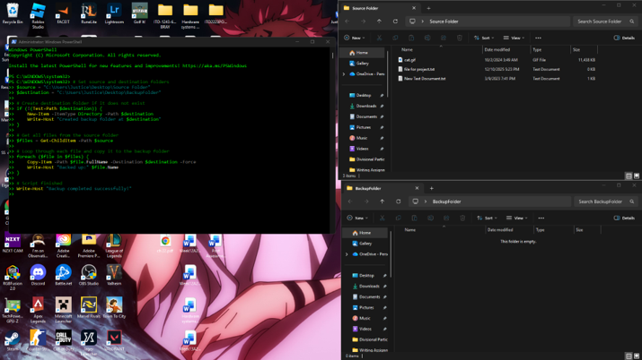
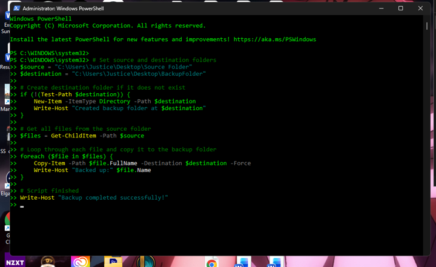
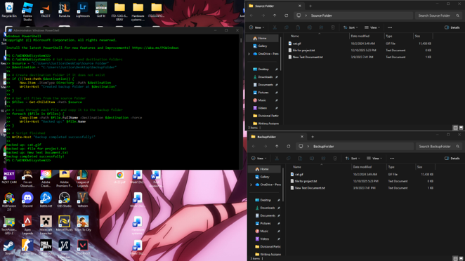
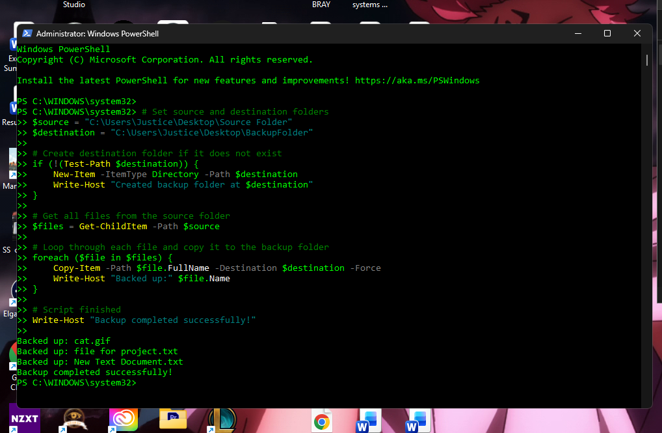
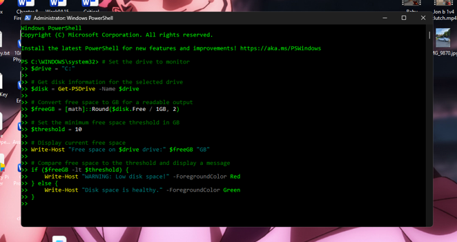
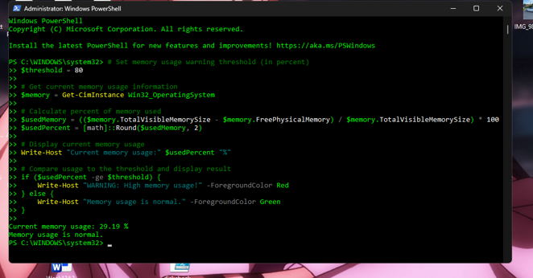

# PowerShell Automation Scripts

**Platform:** Windows 11

**Language:** PowerShell

**Focus:** Windows Administration & Automation

---

# PowerShell Automation Scripts

## Overview

This repository contains two PowerShell scripts I wrote while learning Windows administration and automation. The goal of these projects was to automate common administrative tasks using PowerShell and gain experience working with Windows scripting.

---

## Technologies Used

- Windows PowerShell
- Windows 11
- PowerShell
- Windows Administration

---

## Skills Demonstrated

- PowerShell scripting
- Windows administration
- Automation
- File management
- System monitoring
- Troubleshooting

---

# Backup Script

## What It Does

This script automatically copies files from a source folder to a backup folder. If the destination folder doesn't exist, it creates one before copying the files.

### Concepts Used

- Variables
- Test-Path
- Get-ChildItem
- Copy-Item
- foreach loops

---

# Memory Usage Monitor

## What It Does

This script checks the current RAM usage on a Windows system and displays a warning if memory usage goes above a specified threshold.

### Concepts Used

- Get-CimInstance
- Variables
- If statements
- Memory calculations

---

## Screenshots

The repository includes screenshots showing both scripts running successfully.

---

## What I Learned

This project gave me hands-on experience writing PowerShell scripts for Windows administration. I learned how to automate repetitive tasks, work with common PowerShell cmdlets, and troubleshoot scripting issues while building and testing each script.

## Screenshots

### Backup Script

This script automates file backups by copying files from a source directory to a backup location.

  

---

### Script Breakdown

The script uses PowerShell variables, loops, and file system cmdlets to automate the backup process.

---

### Backup Folder Creation

If the destination folder does not exist, the script creates it automatically before copying files.

---

### Successful Execution

The completed execution after all files have been successfully copied.

## Memory Usage Monitor

### What It Does

This script monitors system memory usage and alerts the user when memory utilization exceeds a predefined threshold.

### Concepts Used

- Get-CimInstance
- Variables
- If Statements
- Memory Calculations
- Conditional Logic

---

## Source Code

- [memory-usage-monitor.ps1](memory-usage-monitor.ps1)

---

## Screenshots

### Memory Monitor Script

The script retrieves current system memory information, calculates RAM utilization, and compares it against a predefined threshold.

**Result:** The script calculates current memory utilization and evaluates whether usage exceeds the configured threshold.

---

### Successful Execution

The script executes successfully and reports the current memory usage along with the appropriate status message.

**Result:** Memory usage is successfully retrieved and displayed after the script completes execution.
